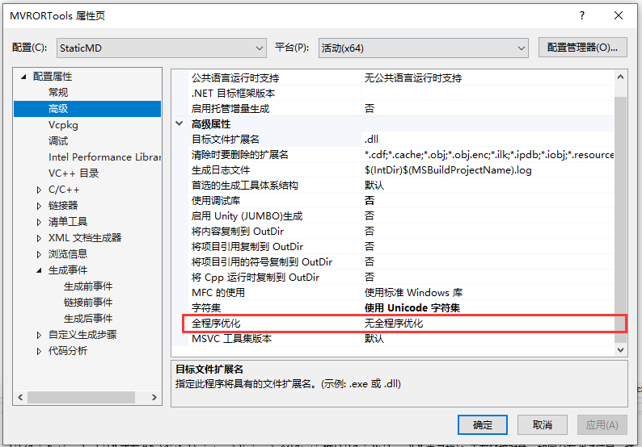
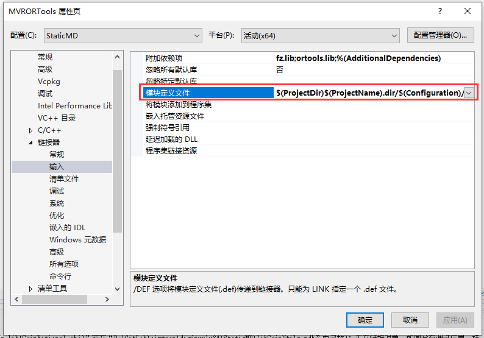
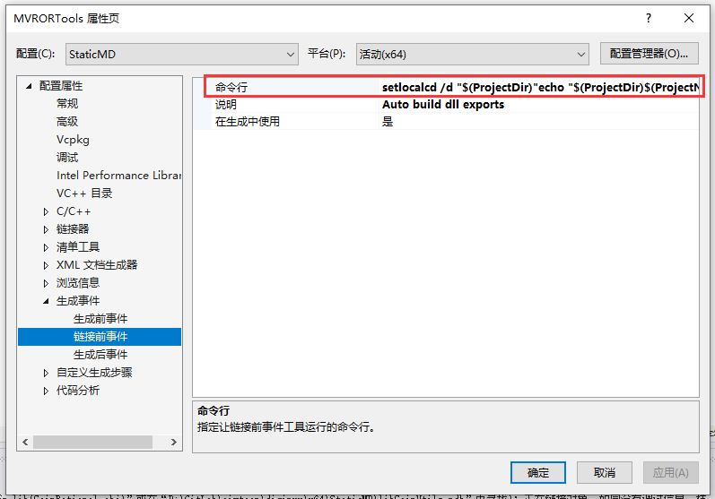

# MSVC的奇技淫巧：自动导出动态链接库

VS要求用户对每个导出函数都添加导出声明来控制Dll的导出，大部分库并没有添加该声明，逐个添加非常麻烦。
用CMAKE的自动DEF生成功能，可以将所有OBJ文件中的函数导出到DEF文件，然后通过DEF文件代替导出声明。

## 操作步骤

### 关闭全程序优化

在使用该功能以前，需要关闭全程序优化，如果开启，OBJ文件不会包含CMAKE的必要信息。



### 指定DEF文件

在链接器中指定DEF文件来代替导出声明：



```
$(ProjectDir)$(ProjectName).dir/$(Configuration)/exports.def
```

### 添加链接前事件

VS2019自带的CMAKE版本满足要求，其它版本未测试。使用CMAKE自动生成DEF：



```
setlocal
cd /d "$(ProjectDir)"
echo "$(ProjectDir)$(ProjectName).dir/$(Configuration)"
md "$(ProjectDir)$(ProjectName).dir/$(Configuration)"
del "$(ProjectDir)$(ProjectName).dir/$(Configuration)/objects.txt"
echo "$(ProjectDir)"
for /R "$(ProjectDir)" %%f in (*.obj) do (
echo %%f > "$(ProjectDir)$(ProjectName).dir/$(Configuration)/objects.txt"
)
"$(DevEnvDir)CommonExtensions\Microsoft\CMake\CMake\bin\cmake.exe" -E __create_def "$(ProjectDir)$(ProjectName).dir/$(Configuration)/exports.def" "$(ProjectDir)$(ProjectName).dir/$(Configuration)/objects.txt"
if %errorlevel% neq 0 goto :cmEnd
:cmEnd
endlocal & call :cmErrorLevel %errorlevel% & goto :cmDone
:cmErrorLevel
exit /b %1
:cmDone
if %errorlevel% neq 0 goto :VCEnd
```
